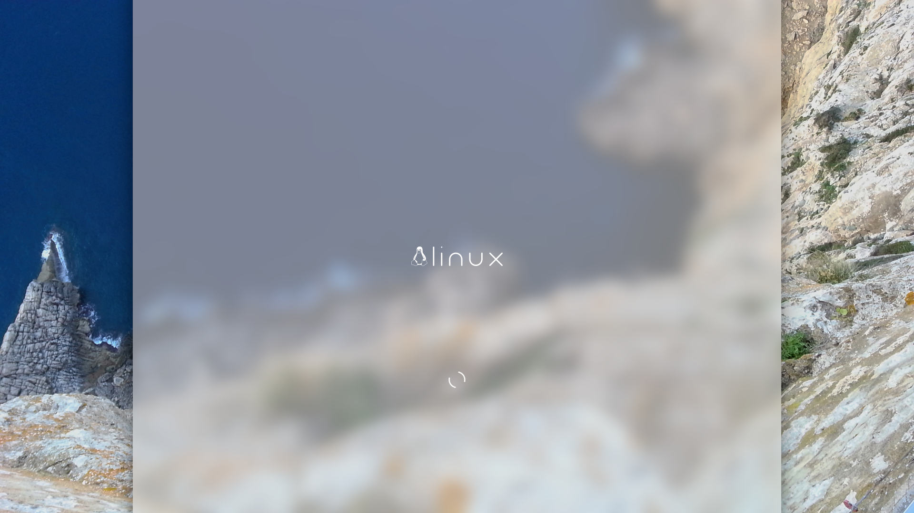

# Plasma Splashscreen White New Tux

This Plasma Splashscreen is a fork of [ManjaroLogoBlack](https://gitlab.com/menelkir/manjarologoblack) by [Daniel Menelkier](https://gitlab.com/menelkir).

A splash theme for KDE 5 based on archlogogreen

## Based on

+ [ManjaroLogoBlack](https://gitlab.com/menelkir/manjarologoblack) by [Daniel Menelkier](https://gitlab.com/menelkir)
+ [archlogogreen](https://www.opendesktop.org/p/997749/) by [sequizz](https://www.pling.com/u/seqizz/)
+ [New Tux](https://store.kde.org/p/1082435) by lewing@isc.tamu.edu Larry Ewing and The GIMP

# How to donate

If you find this repo useful (don't forget to pay a visit to the related
repos too), you can buy me a beer:

